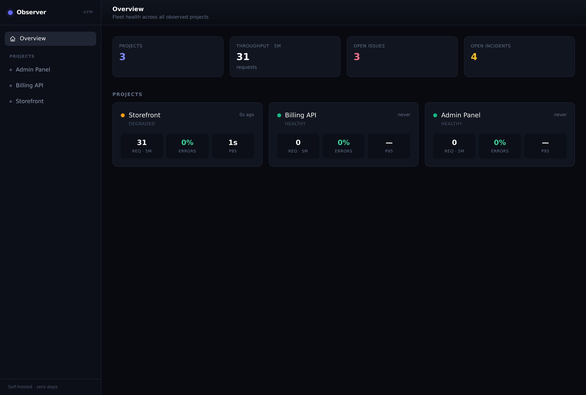
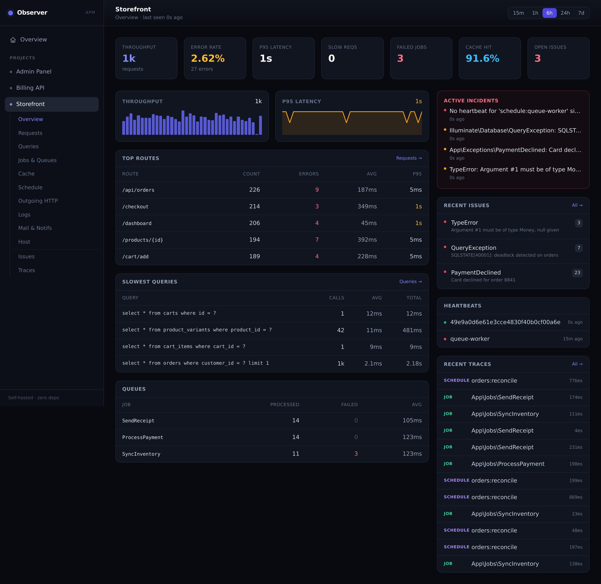
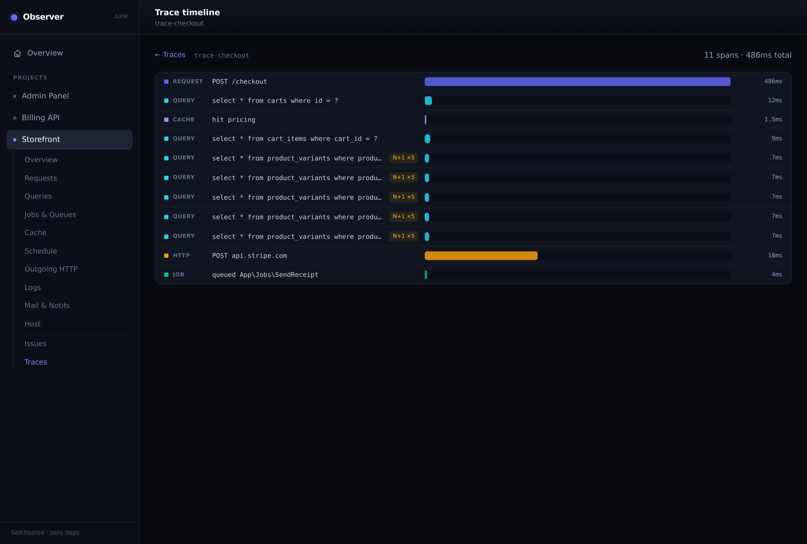
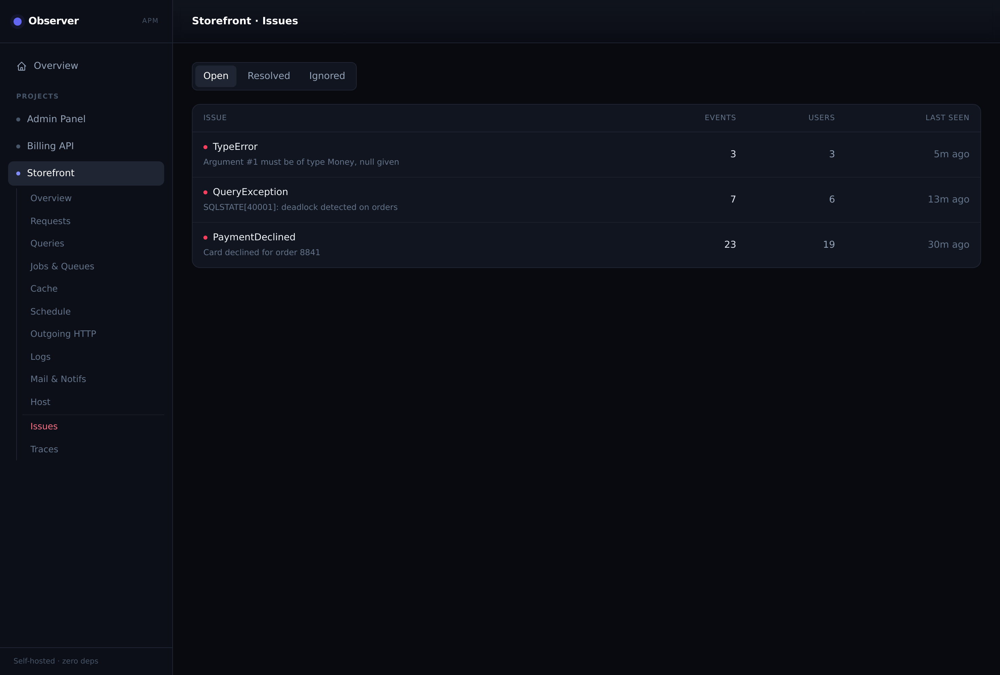

# Warden — Self-Hosted APM for Laravel

> Zero external dependencies. Parent/child observability built entirely on native Laravel
> events, stored in the relational database you already run (MySQL / MariaDB / PostgreSQL).

Warden is a single installable package that gives you full application-performance coverage —
requests, queries, jobs, exceptions, logs, mail, notifications, cache, commands, scheduled
tasks, outbound HTTP, users and host metrics — with correlated traces, exception grouping
into issues, aggregated dashboards and internal alerting. **No SaaS, no third-party agent,
no external service.**

## Why Warden

You already have great tools for **one** app: **Telescope** (local debugging), **Pulse**
(in-app production metrics) and SaaS suites like **Sentry / Flare** (powerful, but paid and
off-premise). The gap nobody fills well is a **single self-hosted panel for your whole fleet
of Laravel apps** — no SaaS account, no agent, no external service, and **zero runtime
dependencies** (no build step, nothing outside Laravel core).

That's Warden: run one parent, point every app at it, and watch the entire fleet from one
place — stored in the database you already operate.

## Screenshots

The parent's self-hosted dashboard (Blade + Tailwind, no build step):

| Fleet overview | Project dashboard |
| --- | --- |
|  |  |
| **Trace timeline** (N+1 flagged) | **Issues** |
|  |  |

## How it works

One app runs as the **parent** (ingests, stores, aggregates, exposes read contracts). Every
other app runs as a **child** (observes its own lifecycle via native Laravel events and ships
batches to the parent). Capture is fully decoupled from delivery:

```
request lifecycle ──> in-memory buffer ──(terminate)──> wdn_outbox ──(warden:ship daemon)──> parent /ingest
```

The request path never does network I/O or heavy serialization. If the parent is offline the
outbox accumulates and drains later — the host app never breaks (RNF-2).

## Getting started

You need **one parent** app (collects + shows the data) and **one or more children**
(the apps you want to observe). The same package powers both — only the mode differs.

### Step 1 — Set up the parent

```bash
composer require victorstochero/warden
php artisan warden:install --parent   # writes .env, publishes, migrates
```

That's it — the parent is in parent mode, the dashboard is live at
`https://apm.example.com/warden`, and the maintenance schedule
(`aggregate` / `evaluate` / `partition` / `prune`) is auto-registered. Just make
sure the Laravel scheduler cron is running (Forge configures it by default):

```
* * * * * cd /path && php artisan schedule:run >> /dev/null 2>&1
```

### Step 2 — Create a project (in the dashboard)

Open the dashboard, go to **Manage projects**, and create one project per child.
On create, the panel shows a **ready-to-run install command** (the secret is shown
only once) — copy it. You can also do it from the CLI:

```bash
php artisan warden:project "My App"            # scheduler delivery (default)
php artisan warden:project "My App" --delivery=daemon
```

### Step 3 — Connect a child

Paste the command from Step 2 into the child app (or into your Forge deploy script —
it is fully non-interactive):

```bash
php artisan warden:install --child \
  --parent-url=https://apm.example.com \
  --project=my-app \
  --token=Yz3... \
  --secret=9aF...
```

This writes the child's `.env`, publishes, migrates, and — with `delivery=scheduler`
(the default) — auto-registers `warden:ship --once` every minute. With the
scheduler cron already running, **nothing else is needed**.

> **High volume?** Create the project with `--delivery=daemon` (or set
> `WARDEN_DELIVERY=daemon`) and supervise `php artisan warden:ship` under
> Supervisor / a Forge Daemon for near-real-time delivery.

### Step 4 — Verify

Generate some traffic on the child (load a page, run a job). Within a minute you'll see the
project light up on the parent's overview, with traces, slow queries, issues and host metrics.
Tune what's captured and how long it's kept in [`config/warden.php`](config/warden.php).

### Tuning knobs (most common)

```dotenv
WARDEN_SAMPLE_REQUEST=1.0        # keep 100% of request traces (lower for high volume)
WARDEN_ALWAYS_KEEP_MS=1000       # always keep traces slower than this, regardless of sampling
WARDEN_RAW_RETENTION_DAYS=7      # how long raw events live
WARDEN_AGG_RETENTION_DAYS=90     # how long aggregates live
WARDEN_DELIVERY=scheduler        # scheduler (cron) or daemon (supervised warden:ship)
```

Disable a noisy recorder entirely, or sample a category, in `config/warden.php`
(`child.recorders` and `child.sample.type_gate`).

## Commands

| Command | Mode | What it does |
|---|---|---|
| `warden:install --parent\|--child` | both | Write `.env`, publish config + migrations, migrate |
| `warden:project {name}` | parent | Create a project (mints token + secret); `--list` to list |
| `warden:ship` | child | Drain the outbox and ship batches (daemon; `--once` for the scheduler) |
| `warden:aggregate` | parent | Roll raw events into aggregates + group exceptions into issues |
| `warden:evaluate` | parent | Evaluate heartbeats/issues, open/resolve incidents, fire alerts |
| `warden:partition` | parent | Ensure/pre-create `wdn_events` partitions (MySQL) |
| `warden:prune` | parent | Apply retention (drop old raw events + aggregates) |
| `warden:audit` | child | Run `composer audit` + `npm audit` and ship vulnerabilities to the parent |
| `warden:demo` | child | Generate one of each event type to exercise the pipeline (dev/testing) |

> The parent's maintenance schedule and the child's shipping (`scheduler` delivery)
> are auto-registered by the package — you only need the Laravel scheduler cron
> running. Set `WARDEN_PARENT_SCHEDULE=false` / `WARDEN_CHILD_SCHEDULE=false`
> to opt out and wire them by hand.

## Dashboard

The parent serves a self-contained dashboard (Blade + a bundled Tailwind
stylesheet served locally —
**no build step, no NPM, no Composer package outside Laravel core**) at the route prefix:

```
https://apm.example.com/warden
```

It reads exclusively through the read layer (`WardenRepository` / `DashboardRepository`) and
covers an overview of all projects (health, throughput, error rate, p95, **30-day uptime**),
per-project drill-down (requests, slow queries + N+1, jobs/queues, cache hit rate, schedule +
heartbeats, outgoing HTTP, logs, mail/notifications, host metrics), grouped issues with stack
traces, and a span-waterfall trace viewer. Access is guarded by the `viewWarden` ability —
define it in a service provider to open it beyond the local environment:

```php
use Illuminate\Support\Facades\Gate;

Gate::define('viewWarden', fn ($user) => $user->isAdmin());
```

Write actions (creating/rotating projects, triggering maintenance commands) are
guarded by a **separate** `manageWarden` ability. Define it the same way:

```php
use Illuminate\Support\Facades\Gate;

Gate::define('manageWarden', fn ($user) => $user->isAdmin());
```

Beyond the aggregate views, each section has a **drill-down** of recent raw events
(the actual log message, mail recipient, job error, outgoing URL + status, per-request
status…), **incidents** are clickable with a detail page, KPI cards link to their
section, the **Logs** breakdown filters the list by level, and a per-project
**timezone** controls how absolute timestamps render. A **Delivery** section shows
when batches arrive (so you can see daemon vs. minute-by-minute cron at a glance), and
**Manage projects** lets you reset a project's metrics, set its display timezone, and
schedule its security audit. See [the wiki](../../wiki) for the full tour.

## Alerting

Incidents (a dead scheduler, an error spike) fire through internal channels
listed in `warden.alerts.channels`. By default that's the Database channel
(the incident surfaces in the dashboard) and the Log channel. To also send
e-mail, enable the mail channel and set recipients — it uses the parent app's
own mailer (`config/mail.php` / your `.env` SMTP), no separate transport:

```dotenv
WARDEN_ALERT_EMAILS=ops@example.com,oncall@example.com
```
```php
// config/warden.php — warden.alerts.channels
\VictorStochero\Warden\Alerting\Channels\MailAlertChannel::class,
```

## Security audits

A child can audit its own dependencies and surface vulnerabilities on the parent:

```bash
php artisan warden:audit            # runs composer audit + npm audit, ships a snapshot
```

The result appears in the project's **Security** section (counts by severity + the
advisory list). To run it automatically, set a frequency per project under **Manage
projects → Audit** (hourly / 6h / daily / weekly): the parent advertises "audit due" on
the ingest response and the child's shipper runs `warden:audit` when it elapses — no
extra cron. A child-side cron (`WARDEN_AUDIT_SCHEDULE=true`, `WARDEN_AUDIT_CRON`) is
also available as an alternative.

## Scaling & databases

- **MySQL / MariaDB**: `wdn_events` is RANGE-partitioned on `occurred_date`;
  `warden:prune` drops whole partitions (cheap at any volume).
- **PostgreSQL / SQLite**: a single table pruned with chunked DELETEs — fine for
  moderate volume; for very high volume prefer MySQL partitioning.
- The parent ingest is a single write path. Past roughly 5–10M events/day on one
  node, scale the parent's database (faster disk, more IOPS) first.
- High shipping volume? Create the project with `--delivery=daemon` and lower
  `warden:ship --batch` if individual traces are large — the parent rejects a
  POST over `WARDEN_MAX_BODY_BYTES` or `WARDEN_MAX_EVENTS` with HTTP 413.

## Security

### Child → parent communication

The ingest channel is authenticated and tamper-evident end to end:

- **Per-project token** identifies the sender; an inactive project or a wrong
  token is rejected with 401.
- **HMAC-SHA256 signature** over the exact request body, compared timing-safe
  (`hash_equals`). The signing secret is stored **encrypted** and shown only once.
- **Anti-replay**: the signed body carries a `sent_at`; bodies outside
  `WARDEN_MAX_SKEW` seconds are rejected as stale.
- **Idempotent dedup**: each batch carries a `batch_id`, so a retried POST is
  recorded once.
- **Rate limiting** on the ingest route (`WARDEN_INGEST_RATE_LIMIT`) plus payload
  guards (`WARDEN_MAX_BODY_BYTES` / `WARDEN_MAX_EVENTS`, HTTP 413).
- **HTTPS enforcement (optional)**: set `WARDEN_REQUIRE_HTTPS=true` on the parent
  to reject any non-TLS ingest (HTTP 403); the child logs a one-time warning if
  `WARDEN_PARENT_URL` is not `https://`. The check honours trusted-proxy headers,
  so a TLS-terminating proxy still works. Off by default.
- Rotate a project's secret any time from **Manage projects → Rotate secret**.

Reminder: a child needs **only** `warden:install --child` plus its `.env`
(`WARDEN_PARENT_URL`, `WARDEN_PROJECT`, `WARDEN_TOKEN`, `WARDEN_SECRET`) — no code.

### Data redaction

Sensitive keys (`warden.child.scrub`) are redacted from query bindings, request
input, headers, log context **and** exception messages; stack-trace file paths
are relativized to the app base path.

### Dashboard access

Read access is gated by the `viewWarden` ability; write actions (managing
projects, triggering maintenance) by a separate `manageWarden`. Pick the model
from the `.env` with **`WARDEN_DASHBOARD_AUTH`** — no code required:

- **`password`** — a built-in login form, independent of the host app's users
  (ideal for a dedicated parent). `WARDEN_DASHBOARD_PASSWORD` grants view access;
  the optional `WARDEN_DASHBOARD_ADMIN_PASSWORD` grants management. With no admin
  password set, any successful login is treated as admin. Passwords are compared
  timing-safe.
- **`email`** — uses the host app's authenticated user. An e-mail in
  `WARDEN_DASHBOARD_EMAILS` gets view access; one in `WARDEN_DASHBOARD_ADMIN_EMAILS`
  gets management (when no admin list is set, the viewer list grants both).
- **`gate`** — advanced: define `viewWarden` / `manageWarden` yourself in a
  service provider. A host-defined gate always wins over the package defaults.

When `WARDEN_DASHBOARD_AUTH` is unset it resolves to `password` if a dashboard
password is configured, otherwise `gate` (local-only) — the historical default.

## Quality

```bash
composer test       # PHPUnit — acceptance criteria from the spec (§15) + dashboard render
composer phpstan    # PHPStan at level max (Larastan), green
```

Static analysis runs at **level `max` with no baseline** — zero errors. `mixed` from
`config()`, `json_decode()` and query-builder rows is narrowed at the edges with typed
helpers (`Support\Cast`, `Support\Json`) and precise array-shape / generic annotations, so
the type information flows all the way through. PHPStan and Larastan are **dev-only** — they
don't affect the zero runtime-dependency guarantee.

See [`config/warden.php`](config/warden.php) for the full configuration surface and
[`docs/ARCHITECTURE.md`](docs/ARCHITECTURE.md) for the design.

## Roadmap

Warden ships incrementally — each release adds one focused capability. Planned next
(see [`docs/ROADMAP.md`](docs/ROADMAP.md) for the full picture and positioning):

- **Multilingual dashboard** — English, Português, Español.
- **Alerts center** — e-mail plus Slack / Discord / generic webhook channels, managed from the UI.
- **Fleet-wide distributed tracing** — one request crossing apps becomes a single trace.
- **Release / deploy tracking** — "errors since this deploy" and regression detection.
- **Real-time dashboard**, configurable uptime windows, and a configurable alert-rule engine.

## License

MIT.
